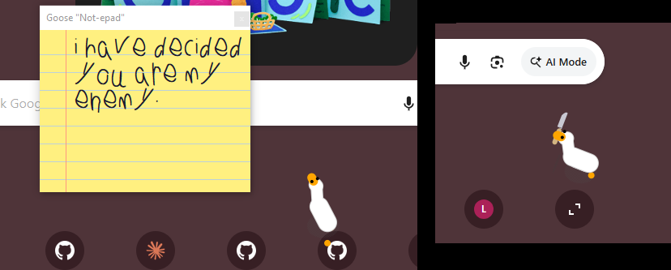

# Desktop Goose: Python Edition

A Python/PyQt6 reimplementation of [samperson's Desktop Goose](https://samperson.itch.io/desktop-goose) — a chaotic little goose that wanders your screen, steals your mouse, and leaves you passive-aggressive notes.

     

---



---

## What it does

A goose lives on your desktop. He has opinions about you. He will:

- **Wander** around your screen minding his own business (sort of)
- **Watch your cursor** — sit down nearby, stare at it, occasionally honk, stare some more. is he planning?
- **Follow you around** at a comfortable distance, march-honking when the mood strikes
- **Sneak up on you** — creep in crawl pose, wait for the right moment, then pounce and steal your mouse
- **Steal your mouse** and drag it somewhere else, honking triumphantly
- **Deliver notepad messages** — handwritten, passive-aggressive, non-negotiable. Keeps up to 2 on screen; evicts one to make room for the next
- **Drop memes** on your screen that you have to deal with — same 2-window rule applies
- **Carry things in** — walks offscreen and returns carrying a knife in his beak. Wanders with it for a while, then either places it deliberately or drops it mid-stride and walks off
- **Track mud** across everything while running amok
- **Sleep in the corner** — circles down in a spiral, tucks his head, and takes a nap
- **Fake sleep** — sometimes he's just pretending, and if he opens one eye and you're too close, he panics

---

## Download (no Python needed)

Prebuilt bundles for Windows, macOS, and Linux are on the [Releases page](https://github.com/claudepc42/PyGoose/releases). Download the archive for your platform, extract it anywhere, and run the `PyGoose` executable — nothing else to install.

| Archive | Platform |
|---------|----------|
| `PyGoose-<version>-windows.zip` | Windows 10/11 |
| `PyGoose-<version>-macos.zip` | macOS |
| `PyGoose-<version>-linux.tar.gz` | Linux |
| `PyGoose-<version>-python-source.zip` | Any platform with Python 3.12+ |

Your customizable `assets/images/memes/` and `assets/text/notepad_messages/` folders sit next to the executable — edit them freely.

---

## Running from source

Requirements:

- Python 3.12+
- PyQt6

```bash
pip install PyQt6
python main.py
```

**macOS only:** Install `pyobjc-framework-Quartz` for full mouse interaction (stealing, petting). Without it the goose still runs, but can't grab your mouse. PyGoose will tell you if it's missing when it starts.

```bash
pip install pyobjc-framework-Quartz
```

You also need to grant **Accessibility** permission to Terminal (or your Python interpreter) in System Settings → Privacy & Security → Accessibility. PyGoose will prompt you on first launch if it's not set.

The goose appears on your desktop. He runs on top of all windows and cannot be clicked through (by design).

---

## Configuration

A `config.ini` is created automatically on first run. Edit it to customize behavior:

| Key | Default | Description |
|-----|---------|-------------|
| `SilenceSounds` | `false` | Mute all sounds |
| `AttackRandomly` | `false` | Goose attacks mouse unprompted |
| `Task_CanAttackMouse` | `true` | Allow mouse-stealing at all |
| `UseCustomColors` | `false` | Enable custom goose colors |
| `GooseColorBody` | `#ffffff` | Body color |
| `GooseColorUnderbody` | `#d3d3d3` | Underbody/outline color |
| `GooseColorBeak` | `#ffa500` | Beak and feet color |
| `MinWanderingTimeSeconds` | `20` | Min time between tasks |
| `MaxWanderingTimeSeconds` | `40` | Max time between tasks |
| `NotepadFontSize` | `25` | Font size in notepad window |

---

## Adding content

### Notepad messages
Drop `.txt` files into `assets/text/notepad_messages/`. One message per file. The goose will pick from them randomly alongside the built-in phrases.

### Memes
Drop image files (`.png`, `.jpg`, `.gif`, `.webp`) into `assets/images/memes/`. The goose will drag them onto your screen.

### Fonts
Drop `.ttf` or `.otf` font files into `assets/fonts/`. The first loaded font is used for the notepad. A handwriting-style font works well.

---

## Goose behaviors

| Behavior | Description |
|----------|-------------|
| Wander | Walks to random screen positions, pausing occasionally |
| Watch Mouse | Sits near the cursor, staring at it. Bobs head. Rarely honks. Will sit and crouch if the mood takes him. |
| Follow Mouse | Rushes to preferred distance (90–160px) and trails the cursor. Flees if you get too close. Occasionally honks in a march. |
| Sneak Attack | Crouches into a crawl, sneaks toward cursor, then pounces and drags the mouse |
| Nab Mouse | Chases cursor at full speed, grabs it with his beak, drags it away |
| Track Mud | Runs offscreen into a mud puddle, then sprints back across the screen leaving footprints |
| Collect Notepad | Drags a passive-aggressive notepad message onto your screen. Keeps up to 2 notes on screen at once — if 2 are already up, grabs a random one and drags it back offscreen before fetching a new one |
| Collect Meme | Drags a meme image onto your screen. Same 2-window limit and eviction behavior as notepad |
| Carry Prop | Walks offscreen and returns carrying a knife in his beak. Wanders for a while, then either places it carefully on the ground or drops it mid-walk and moves on. If there's already one on screen, picks it up instead of fetching a new one |
| Sleep | Walks to a corner, circles in a shrinking spiral, then tucks in for 90 seconds to 8 minutes |
| Fake Sleep | Looks like real sleep but isn't — see above |
| Peek Back | Post-freak-out return sequence: crawl to edge, peek in, sweep gaze, walk back |

---

## Quitting

Hold **ESC** for ~5 seconds. A progress bar slides down from the top of the screen. Keep holding to evict the goose.

---

## Project structure

```
PyGoose/
├── main.py                    # Entry point
├── config.ini                 # Auto-generated settings (not tracked)
├── assets/
│   ├── fonts/                 # Handwriting fonts for notepad
│   ├── images/memes/          # Meme images
│   ├── sounds/                # Honks, pats, music
│   └── text/notepad_messages/ # Goose notes
├── pygoose/
│   ├── engine/                # Vector math, IK rig, timing, deck shuffle
│   └── goose/                 # Game loop, renderer, tasks, windows, props
└── tests/
```

---

## Developer flags

For testing specific behaviors without waiting for them to appear naturally, edit `config.ini` and restart:

```ini
DEV_ForceTask = collect_window_notepad  ; force a specific task every time (blank to disable)
DEV_ShortWander = True                  ; wander lasts only 3 seconds
DEV_ForceFakeSleep = True               ; always fake sleep instead of 15% chance
DEV_ForceSpawnProp = knife              ; spawn a prop in debug view for visual design (blank to disable)
DEV_HideGoose = True                    ; hide the goose (use with DEV_ForceSpawnProp)
```

Setting `DEV_ForceSpawnProp` activates the prop design mode: a white debug box shows multiple size/shape variants of the prop side by side, a compass ring of 8 reference geese in every direction for orientation testing, live shadow previews at carried and ground height, and a floating prop moving on a sine wave to check shadow depth at varying Z heights. Click the flip button to mirror the whole layout to the right side of the screen. Use `DEV_ForceTask = wander` alongside it to keep the (hidden) goose out of the way.

```ini
```

---

## Credits

- Original Desktop Goose by [samperson](https://samperson.itch.io/desktop-goose)
- Rewritten from scratch in Python — no original assets used (sounds extracted from the original exe for personal use only, not redistributed)
